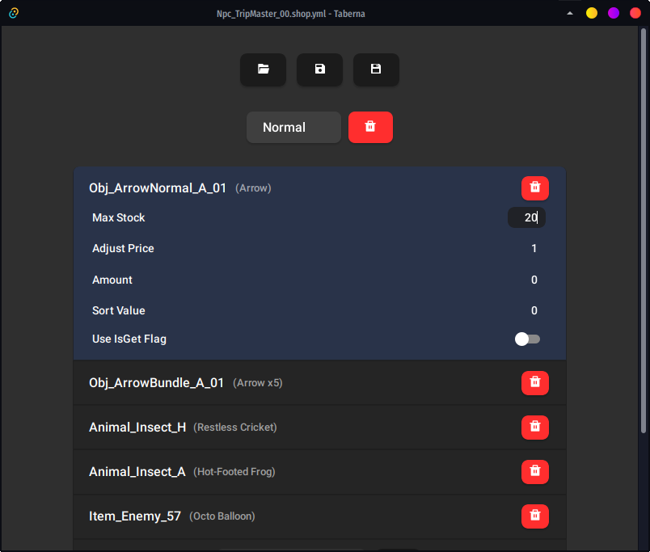

# Taberna

Easy shop table editor for BOTW

## Setup

Requires the latest (2019) Visual C++ redistributable for x64, downloadable 
[here](https://aka.ms/vs/16/release/vc_redist.x64.exe).

Download the release executable and run it.

## Usage

Taberna can edit BOTW shop data files (extension `.bshop`), used to manage
inventories for Beedle, other merchants, and other actors with a merchant-based
interface (e.g. Cherry). Both the original binary format and the common YAML
format (used by tools like [`aamp`](https://github.com/zeldamods/aamp) or [Wild
Bits](https://github.com/NiceneNerd/Wild-Bits)) are supported.

The UI should be fairly self-explanatory if you know how shop data files work.
For information about shop data files, check [the entry on the ZeldaMods 
wiki](https://zeldamods.org/wiki/Bshop).

## Known Issues

Presently none.

## Building from Source

Building from source requires, in *addition* to the general prerequisites:

-   Node.js v16
-   Rust/Cargo (MSRV 1.61)

Taberna is a Tauri app, so you can install the Tauri CLI with `npm i -g
@tauri-apps/cli` or `cargo install tauri-cli`. Then run `npm install` to
install the NPM packages. From there `tauri dev` will launch Tauri in
development mode (dev tools enabled and "hot-ish" reloading), and `tauri build`
will compile a release build.
